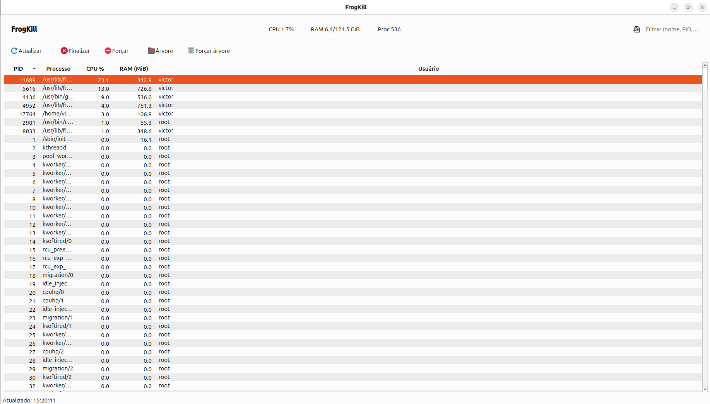

# FrogKill 🐸⚡  
A lightweight, native Linux Task Manager with global hotkeys, tray daemon, and a secure root helper.

<p align="center">
  
</p>

<p align="center">
  <b>Windows-like workflow on Linux:</b> process list → press <kbd>Del</kbd> to terminate → confirm → done.
  <br/>
  <b>Global hotkey:</b> <kbd>Ctrl</kbd> + <kbd>Shift</kbd> + <kbd>Esc</kbd> to toggle.
</p>

<p align="center">
  
</p>

---

## Table of Contents
- [What is FrogKill?](#what-is-frogkill)
- [Highlights](#highlights)
- [Download](#download)
- [Keyboard Shortcuts](#keyboard-shortcuts)
- [Security Model (Root Helper)](#security-model-root-helper)
- [Installation (Prebuilt)](#installation-prebuilt)
- [Build from Source (clang++ + lld)](#build-from-source-clang--lld)
- [System Integration](#system-integration)
  - [Run at Login (systemd --user)](#run-at-login-systemd---user)
  - [Autostart (.desktop)](#autostart-desktop)
  - [Global Hotkey: Ctrl+Shift+Esc](#global-hotkey-ctrlshiftesc)
  - [Desktop Menu Entry](#desktop-menu-entry)
- [Uninstall](#uninstall)
- [Troubleshooting](#troubleshooting)
- [FAQ](#faq)
- [License](#license)

---

## What is FrogKill?
**FrogKill** is a native Linux task manager designed to feel **as simple as the Windows Task Manager**, but implemented properly for modern Linux desktops (including Wayland).

It provides:
- A fast process list (PID, name, CPU %, RSS memory, user)
- A keyboard-driven workflow (terminate with <kbd>Del</kbd>)
- A tray daemon that can run from login
- A global toggle hotkey via desktop integration
- A **secure** root helper using **pkexec / polkit** (only when required)

---

## Highlights
- ✅ **C++23 + Qt 6 Widgets** (native, no web UI)
- ✅ **Global hotkey** toggle (recommended: <kbd>Ctrl</kbd> + <kbd>Shift</kbd> + <kbd>Esc</kbd>)
- ✅ **Tray daemon** mode (available from login)
- ✅ **Safe root helper** via **pkexec / polkit** (prompts for password only if needed)
- ✅ Process actions:
  - Terminate (SIGTERM)
  - Force kill (SIGKILL)
  - Terminate **process tree** (parent + children)
- ✅ Confirmation dialogs before destructive actions
- ✅ Designed to minimize overhead:
  - **Near-zero CPU usage when UI is hidden**
  - Efficient `/proc` parsing + caching

---

## Download
### Prebuilt release (clang + lld build)
Download the official archive:

**v1.0.0**
- `frogkill-1.0.0-build-clang-linux-x86_64.tar.gz`  
  https://github.com/victormeloasm/frogkill/releases/download/v1.0/frogkill-1.0.0-build-clang-linux-x86_64.tar.gz

> This archive contains the full `build-clang` directory.

---

## Keyboard Shortcuts
Inside the FrogKill UI:

- **Terminate selected process**
  - <kbd>Del</kbd> → SIGTERM (with confirmation)
- **Force kill selected process**
  - <kbd>Shift</kbd> + <kbd>Del</kbd> → SIGKILL (with confirmation)
- **Terminate process tree (parent + children)**
  - <kbd>Ctrl</kbd> + <kbd>Del</kbd> → SIGTERM tree (with confirmation)
- **Force kill process tree**
  - <kbd>Ctrl</kbd> + <kbd>Shift</kbd> + <kbd>Del</kbd> → SIGKILL tree (with confirmation)

Additionally:
- **Right-click** a row to open the context menu (Terminate / Force / Tree variants).

---

## Security Model (Root Helper)
Linux correctly prevents unprivileged users from killing some processes (or killing processes owned by other users). FrogKill handles this safely:

1. FrogKill tries to terminate a process normally (`kill(pid, SIGTERM)`).
2. If the kernel returns `EPERM` (permission denied), FrogKill offers:
   > “Administrator privileges are required. Authenticate?”
3. If you accept, FrogKill calls a dedicated helper through **pkexec**:
   - **pkexec** triggers **polkit** authentication UI (password prompt).
   - The helper runs as root only to perform the requested action, then exits.

**Important design goal:**  
FrogKill does **not** use setuid binaries. The helper is restricted and only accepts explicit arguments for:
- PID
- signal (TERM/KILL)
- optional tree mode

This keeps the privileged surface small and auditable.

---

## Installation (Prebuilt)
### 1) Download and extract
```bash
wget -O frogkill-1.0.0-build-clang-linux-x86_64.tar.gz \
  https://github.com/victormeloasm/frogkill/releases/download/v1.0/frogkill-1.0.0-build-clang-linux-x86_64.tar.gz

mkdir -p ~/frogkill_release
tar -xzf frogkill-1.0.0-build-clang-linux-x86_64.tar.gz -C ~/frogkill_release
````

You should now have:

```bash
ls ~/frogkill_release/build-clang
```

### 2) Run directly (portable)

```bash
~/frogkill_release/build-clang/frogkill
```

### 3) Install “natively” (recommended)

If the build directory contains install targets, you can install using CMake install:

```bash
cd ~/frogkill_release/build-clang
sudo cmake --install .
```

This typically installs:

* `/usr/local/bin/frogkill`
* `/usr/libexec/frogkill-helper`
* polkit policy file (system path varies per distro)

After installation:

```bash
which frogkill
frogkill --toggle
```

> If you are packaging manually, you can also copy binaries yourself, but `cmake --install` is strongly recommended.

---

## Build from Source (clang++ + lld)

### Dependencies (Ubuntu)

```bash
sudo apt update
sudo apt install -y \
  build-essential cmake pkg-config \
  clang lld \
  qt6-base-dev qt6-base-dev-tools qt6-tools-dev qt6-tools-dev-tools \
  polkitd pkexec
```

### Build (clang + lld)

From the repository root:

```bash
rm -rf build-clang
cmake -S . -B build-clang \
  -DCMAKE_BUILD_TYPE=Release \
  -DCMAKE_C_COMPILER=clang \
  -DCMAKE_CXX_COMPILER=clang++ \
  -DCMAKE_EXE_LINKER_FLAGS="-fuse-ld=lld" \
  -DCMAKE_SHARED_LINKER_FLAGS="-fuse-ld=lld"

cmake --build build-clang -j"$(nproc)"
```

Run:

```bash
./build-clang/frogkill
```

Install:

```bash
sudo cmake --install build-clang
```

---

## System Integration

### Run at Login (systemd --user)

Recommended for modern desktops: reliable, restarts on failure, easy logs.

Create a user service:

```bash
mkdir -p ~/.config/systemd/user

cat > ~/.config/systemd/user/frogkill.service <<'EOF'
[Unit]
Description=FrogKill daemon (tray)

[Service]
ExecStart=/usr/local/bin/frogkill --daemon
Restart=on-failure
RestartSec=1

[Install]
WantedBy=default.target
EOF
```

Enable it:

```bash
systemctl --user daemon-reload
systemctl --user enable --now frogkill.service
```

Check status/logs:

```bash
systemctl --user status frogkill.service
journalctl --user -u frogkill.service -f
```

---

### Autostart (.desktop)

Alternative method used by many desktops:

```bash
mkdir -p ~/.config/autostart

cat > ~/.config/autostart/frogkill.desktop <<'EOF'
[Desktop Entry]
Type=Application
Name=FrogKill
Comment=Lightweight task manager daemon
Exec=frogkill --daemon
Terminal=false
X-GNOME-Autostart-enabled=true
Categories=System;Monitor;
EOF
```

---

### Global Hotkey: Ctrl+Shift+Esc

**Wayland-safe approach:** configure the global keybinding in your desktop environment and map it to:

```bash
frogkill --toggle
```

#### GNOME (manual)

* Settings → Keyboard → Keyboard Shortcuts → Custom Shortcuts
* Command: `frogkill --toggle`
* Shortcut: `Ctrl+Shift+Esc`

#### KDE Plasma (manual)

* System Settings → Shortcuts → Custom Shortcuts
* Add command: `frogkill --toggle`
* Bind to `Ctrl+Shift+Esc`

> FrogKill intentionally avoids unsafe global key grabs on Wayland. Desktop-level keybinding is the correct method.

---

### Desktop Menu Entry

Create a menu launcher:

```bash
mkdir -p ~/.local/share/applications

cat > ~/.local/share/applications/frogkill.desktop <<'EOF'
[Desktop Entry]
Type=Application
Name=FrogKill
Comment=Native Linux Task Manager
Exec=frogkill
Icon=utilities-system-monitor
Terminal=false
Categories=System;Monitor;
StartupNotify=true
EOF
```

Optional:

```bash
update-desktop-database ~/.local/share/applications 2>/dev/null || true
```

#### Using the project logo as the app icon

If you want FrogKill to use `assets/logo.png` as the launcher icon:

1. Copy it to your local icon theme:

```bash
mkdir -p ~/.local/share/icons/hicolor/256x256/apps
cp assets/logo.png ~/.local/share/icons/hicolor/256x256/apps/frogkill.png
```

2. Change `Icon=` in the .desktop entry:

```ini
Icon=frogkill
```

---

## Uninstall

If you installed via `cmake --install`, uninstall depends on your install strategy.
CMake does not always generate an uninstall target by default.

Typical manual cleanup (if installed to `/usr/local`):

```bash
sudo rm -f /usr/local/bin/frogkill
sudo rm -f /usr/libexec/frogkill-helper
sudo rm -f /usr/share/polkit-1/actions/org.frogkill.helper.policy \
           /usr/local/share/polkit-1/actions/org.frogkill.helper.policy 2>/dev/null || true
```

Disable login service (if used):

```bash
systemctl --user disable --now frogkill.service
rm -f ~/.config/systemd/user/frogkill.service
systemctl --user daemon-reload
```

Remove desktop entries:

```bash
rm -f ~/.local/share/applications/frogkill.desktop
rm -f ~/.config/autostart/frogkill.desktop
```

---

## Troubleshooting

### 1) CMakeCache source directory mismatch

If you moved the project folder and CMake complains:

> “CMakeCache.txt directory is different…”

Fix: wipe build dir and reconfigure.

```bash
rm -rf build build-clang
cmake -S . -B build-clang -DCMAKE_BUILD_TYPE=Release ...
```

### 2) `pkexec` prompts do not appear

Test polkit quickly:

```bash
pkexec /usr/bin/id
```

If you get “no authentication agent”:

* On GNOME this usually works automatically.
* On minimal/tiling setups, you might need a polkit agent running.

### 3) Cannot kill process even with root helper

Some kernel/system processes may not be killable or will instantly respawn due to service managers.
Try stopping services via systemd if appropriate.

### 4) Global hotkey doesn’t work

On Wayland you must bind the shortcut at the desktop level.
Make sure the command is exactly:

```bash
frogkill --toggle
```

And `frogkill` is in PATH:

```bash
which frogkill
```

### 5) Tray icon not showing

Some desktops require tray support enabled (especially GNOME).
If GNOME hides tray icons, use an extension or rely on `--toggle` + launcher.

---

## FAQ

### Why Ctrl+Shift+Esc and not Ctrl+Alt+Del?

On Linux, <kbd>Ctrl</kbd>+<kbd>Alt</kbd>+<kbd>Del</kbd> can be reserved by the system (systemd/logind, DE session actions).
Ctrl+Shift+Esc is the most reliable, Wayland-friendly, desktop-configurable option.

### Does FrogKill work on Wayland?

Yes. Global shortcuts are handled via desktop keybindings (correct approach for Wayland security).

### Is it safe?

FrogKill uses a strict, minimal privileged helper via pkexec/polkit rather than setuid.
The app only escalates when the kernel denies permission and you confirm.

## License

MIT - Víctor Duarte Melo - 2025

